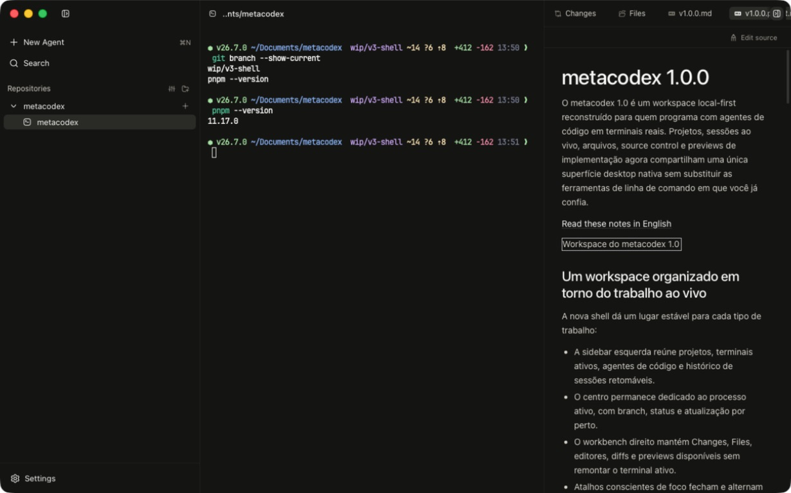

<div align="center">

<picture>
  <source media="(prefers-color-scheme: dark)" srcset="./public/white-metacodex-icon.png">
  
</picture>

# metacodex

**A premium local-first developer workspace for terminal-native AI coding.**

VS Code-style file navigation. Cursor-grade visual calm. Claude Code, Codex CLI, OpenCode and friends — running as real PTY tabs in a native desktop shell.

[](https://tauri.app/)
[](https://react.dev/)
[](https://www.typescriptlang.org/)
[](https://www.rust-lang.org/)
[](#requirements)

[Português 🇧🇷](./README.pt-BR.md)

</div>

---

<div align="center">
  
</div>

## What is metacodex?

metacodex is a desktop app that puts the **file tree, the editor, the terminal, and your AI coding agent in the same window**, without throwing away the things developers actually rely on (real PTYs, real `$SHELL -l`, real git, your `.zshrc`).

It's built as a **Tauri 2** shell — a small Rust core that owns every system call (PTY, filesystem, search, watcher, git) — and a **React 19 + TypeScript** frontend that is purely UI and state. Everything lives **local-first**: no auth, no cloud round-trip, no telemetry. Settings, projects and per-workspace state persist as hand-editable JSON in `~/.metacodex/`.

It feels closer to Linear / Raycast than to a typical Electron IDE: token-driven theming, a single opacity fade for every popup, native-style focus rings, and a tab bar that doesn't leak browser chrome.

## Download & install

Download the installer for your platform from the [latest release](https://github.com/victorbenazzi/metacodex/releases/latest):

| Platform | Download | Install |
|---|---|---|
| macOS Apple Silicon | `metacodex_*_aarch64.dmg` | Drag the app to `/Applications` |
| macOS Intel | `metacodex_*_x64.dmg` | Drag the app to `/Applications` |
| Windows x64 | `metacodex_*_x64-setup.exe` or `.msi` | Run the installer |
| Debian / Ubuntu x64 | `metacodex_*_amd64.deb` | `sudo apt install ./metacodex_*_amd64.deb` |
| Fedora / RPM x64 | `metacodex-*.x86_64.rpm` | `sudo dnf install ./metacodex-*.x86_64.rpm` |

No account and no setup wizard. macOS builds are not notarized, and Windows builds are not code-signed yet.

> [!WARNING]
> macOS Gatekeeper blocks the current DMG before it mounts because the build is self-signed and not notarized by Apple. Follow the [macOS Gatekeeper instructions](#macos-gatekeeper-notice) before the first launch.

## Auto-update

From **v0.0.3** onwards, the macOS and Windows builds can update themselves. Shortly after launch the app checks this repo's `latest.json`; when a newer release exists, a blue **Update** pill appears in the center chrome. One click downloads the updater payload, verifies it against the bundled public key, installs it and relaunches the app. Linux `.deb` and `.rpm` packages update through the system package installation flow.

> [!NOTE]
> If macOS quarantines the app again after an in-place update, follow the same [Gatekeeper instructions](#macos-gatekeeper-notice). A future release signed with an Apple Developer ID and notarized by Apple will remove this extra step.

## Legacy version

The product that shipped before the 1.0 workspace rebuild remains available as [Legacy v0.0.19](https://github.com/victorbenazzi/metacodex/releases/tag/v0.0.19). Its source is frozen on [`legacy/v0`](https://github.com/victorbenazzi/metacodex/tree/legacy/v0). Existing tags and release assets remain untouched.

## Why

| Pain | metacodex's take |
|---|---|
| AI coding CLIs feel great in isolation but lousy as a workspace | First-class **PTY tabs** for Claude Code, Codex CLI, OpenCode, Grok Build, MiMo Code, Antigravity, and Pi. They launch through `$SHELL -l -i -c` so your `mise` / `nvm` / `.zshrc` PATH is intact. |
| Electron IDEs are heavy, slow to launch, fragile on resize | Tauri 2 native shell, ~tens of MB binary, instant cold start. |
| "Open with terminal" is a context-switch | Terminal and editor live in the **same tab bar**, keyed per project. |
| Cloud-bound settings get out of sync | Plain JSON in `~/.metacodex/`. Edit it in vim if you want. |
| File watchers, search, git all reinvented per app | One debounced `notify` watcher per project, ripgrep-grade search via `grep-searcher`, `libgit2` via `git2`. |

## Features

### Workspace
- **Three-surface shell** with projects and live sessions on the left, the active process in the center, and a persistent workbench on the right.
- **Resizable and collapsible columns** that keep terminals and documents mounted while hidden.
- **Per-project session history** for recent agent work (`resume.json`).
- **Command palette** (`Cmd+Shift+P`) for commands and files.
- **Porcelain and Graphite themes** plus compact, comfortable and spacious UI density.

### File Explorer (fully mutable)
- Create, rename, delete, drag-move — VS Code parity.
- Every mutation is roots-checked in Rust; moves **refuse on conflict** instead of overwriting.
- Open editor tabs follow renames; closed paths drop dead tabs.
- Atomic writes (`<path>.metacodex.tmp` → `rename`).

### Editor (CodeMirror 6)
- Language packs for TS/JS, Rust, Go, Python, Java, C/C++, PHP, HTML/CSS/Less/Sass, JSON, YAML, SQL, Markdown, Vue, Angular, and more.
- Sticky scroll headers, merge view, search/replace, autocomplete.
- Markdown / image / PDF previews as native tab kinds.

### Terminal & AI CLIs
- xterm.js v5.5 with the Canvas renderer (carefully deferred load order — see `useXterm.ts`), DOM fallback on failure.
- Bundled **JetBrains Mono Nerd Font** for TUI glyphs (Claude Code box-drawing, Codex spinners) — `lineHeight` is pinned to 1.0 by design.
- One-click launcher for any CLI in the registry (`cli-registry.ts`): Claude Code, Codex CLI, OpenCode, Grok Build, MiMo Code, Antigravity, Pi.
- **Agent status** per tab (`idle | working | needs-attention | done`) driven by OSC parsing + heuristics; jump to the next attention with `Cmd+Shift+U`.
- **Tab tooltip** with per-tab branch, cwd, and listening ports (polled from Rust).
- OS notifications + sound when an agent finishes or needs you.

### Source Control
- Right-panel SCM view backed by `libgit2`.
- **Worktrees** — list, create, switch, merge from the same panel.

### Project browser
- Native in-app browser for detected development servers and authorized local files.
- Pick elements, draw annotations and capture precise regions.
- Send DOM and visual context directly to the active coding agent.
- Isolated browser profile with authenticated bridge messages and project-root path controls.

### Settings & Keybindings
- Plain JSON in `~/.metacodex/settings.json` and `~/.metacodex/keybindings.json` (the latter only stores overrides).
- Editor & terminal font, scrollback, sticky headers, debounces, UI density (compact / comfortable / spacious — drives every `--space-*` token via a CSS `calc()`).
- Every shortcut rebindable (`Cmd+,` → Keybindings, or edit the JSON).
- Theme: light / dark / system. Follows `prefers-color-scheme` by default.

### Internationalisation
- English (default) and Brazilian Portuguese out of the box (`react-i18next`).
- All UI strings go through `t()` — never hardcoded.

## Requirements

metacodex 1.0 targets macOS, Windows x64 and Linux x64 from one Tauri codebase. Platform-specific browser capture uses WKWebView on macOS, WebView2 on Windows and WebKitGTK on Linux.

To run from source you need:

| Tool | Why |
|---|---|
| **Supported desktop OS** | macOS 12+, Windows 10/11 x64, or a modern x64 Linux distribution with WebKitGTK 4.1 |
| **Platform build tools** | Xcode CLT on macOS, MSVC Build Tools on Windows, or Tauri system dependencies on Linux |
| **Rust** (stable) | Tauri Rust core — install via [`rustup`](https://rustup.rs) |
| **Node.js 20+** | Vite / TS |
| **pnpm** | Package manager — `npm i -g pnpm` (or `corepack enable`) |

## Install (from source)

```bash
# 1. Clone
git clone https://github.com/victorbenazzi/metacodex.git
cd metacodex

# 2. Install JS deps
pnpm install

# 3. Run the desktop app (Vite + Tauri, hot reload)
pnpm tauri dev
```

The Vite dev server binds to **port 1420** (`strictPort: true`); Tauri's `beforeDevCommand` boots it. Don't change the port without updating `src-tauri/tauri.conf.json`.

## Build a release bundle

```bash
# Produces the native bundle for the current operating system
pnpm tauri build
```

The release profile is tuned for size (`opt-level = "s"`, `lto`, `panic = "abort"`, `strip`). Expect a fairly small native binary.

## Available commands

| Task | Command |
|---|---|
| Run the desktop app | `pnpm tauri dev` |
| Run only the Vite frontend (no native shell) | `pnpm dev` |
| Type-check + production frontend build | `pnpm build` |
| Type-check only | `pnpm exec tsc --noEmit` |
| Frontend unit tests | `pnpm test` |
| Rust checks and tests | `cargo check` / `cargo test` in `src-tauri/` |
| Production Tauri bundle | `pnpm tauri build` |
| Preview the built frontend in a browser | `pnpm preview` |

There is no separate frontend lint command. TypeScript, Vitest, Rust formatting, Clippy, Rust tests and specification traceability run in the GitHub Actions quality matrix.

## macOS Gatekeeper notice

The current macOS build is self-signed, not signed with an Apple Developer ID, and not notarized by Apple. Gatekeeper can therefore block the downloaded DMG before it mounts with a message such as:

> *Apple could not verify that "metacodex_1.0.0_aarch64.dmg" is free of malware that may harm your Mac or compromise your privacy.*

Apple has not reviewed this build. Continue only if you downloaded the DMG from the [official metacodex release](https://github.com/victorbenazzi/metacodex/releases/tag/v1.0.0).

### Recommended: allow it in System Settings

1. Double-click the DMG once and dismiss the warning.
2. Open **Apple menu > System Settings > Privacy & Security**.
3. Scroll to **Security** and click **Open Anyway**. Apple makes this option available for about one hour after the blocked attempt.
4. Confirm **Open**, mount the DMG, and drag `metacodex.app` into `/Applications`.

This is the override flow documented by [Apple Support](https://support.apple.com/102445).

### Terminal fallback

First verify the SHA-256 checksum for the file you downloaded:

| Mac | File | Expected SHA-256 |
|---|---|---|
| Apple Silicon | `metacodex_1.0.0_aarch64.dmg` | `859521bc39f023768c244d00cac9135a34eb42474715b7e15e328839819ff5f6` |
| Intel | `metacodex_1.0.0_x64.dmg` | `fdbd4154754d36859f72a5f024e7b498575f1bf52747a15a4e10d90e001b0fc4` |

```bash
shasum -a 256 "$HOME/Downloads/metacodex_1.0.0_aarch64.dmg"
```

If the checksum matches, remove quarantine from that DMG only and open it:

```bash
xattr -d com.apple.quarantine "$HOME/Downloads/metacodex_1.0.0_aarch64.dmg"
open "$HOME/Downloads/metacodex_1.0.0_aarch64.dmg"
```

Intel users should replace `aarch64` with `x64`. After the DMG mounts, drag `metacodex.app` into `/Applications`. If Gatekeeper blocks the copied app as well, run:

```bash
sudo xattr -dr com.apple.quarantine "/Applications/metacodex.app"
open "/Applications/metacodex.app"
```

These commands remove quarantine only from the specified metacodex file. They do not disable Gatekeeper for the system.

## Where things live on disk

```
~/.metacodex/
├── settings.json          # editable user prefs (theme, language, fonts, terminal, debounces, density)
├── keybindings.json       # only shortcuts that differ from defaults
└── state/
    ├── projects.json       # registered project roots + lastActiveProjectId
    ├── resume.json         # recent agent sessions (pruned to last 30 days at boot)
    └── workspace/<id>.json # per-project: open tabs, active tab, expanded paths
```

Everything is plain, pretty-printed, hand-editable JSON. Writes are atomic (tmp → rename). **Terminals and CLI tabs are intentionally not persisted** — shells aren't auto-respawned on app start.

## Architecture, in one screen

```
+-----------------------------------+         +-----------------------------------+
|     React 19 + TypeScript (UI)    |  IPC    |       Rust + Tauri 2 (shell)      |
|-----------------------------------|<------->|-----------------------------------|
| Zustand stores per feature        | invoke  | commands/  fs / git / pty / ...   |
| CodeMirror 6 editor               |  +      | PtyManager (portable-pty)         |
| xterm.js v5.5 + Canvas addon      | emit    | WatcherManager (notify)           |
| Radix dialogs / menus / tooltips  |         | ProjectsCache (Arc<RwLock<…>>)    |
| Tailwind + token-driven theming   |         | ensure_within_roots on every FS   |
| react-i18next (en / pt-BR)        |         | git2 / grep-searcher / ignore     |
+-----------------------------------+         +-----------------------------------+
                                                            |
                                                            v
                                                   ~/.metacodex/  (JSON)
```

The boundary is strict: **Rust owns all OS/IO; React owns rendering and ephemeral UI state.** Nothing in `src/` reads from disk or spawns processes directly — every side effect goes through a Tauri command listed in `src/lib/ipc.ts::CMD` and registered in `src-tauri/src/lib.rs::invoke_handler!`.

Path safety is enforced in one place: every filesystem command calls `paths::ensure_within_roots(target, &roots)` before any `fs::*` call. `is_within` does lexical normalisation only — no symlink resolution — so a symlink can't escape the sandbox via realpath.

For the deep tour see [`CLAUDE.md`](./CLAUDE.md) and [`AGENTS.md`](./AGENTS.md).

## Contributing

1. Fork & branch from `main`.
2. `pnpm install`, then `pnpm tauri dev`.
3. Keep the Rust/TS boundary clean — no `fs::*` or process spawn outside a roots-checked Tauri command.
4. Tokens drive the visuals; **never hardcode colours** in components — go through `src/styles/tokens.css`.
5. All UI text must go through `t()` and be added to **both** locale files (`en` and `pt-BR`).
6. `pnpm build` (which runs `tsc --noEmit`) must pass before opening a PR.

The longer playbook — including the xterm.js load-order rule, the `lineHeight = 1.0` rule, the popup-motion rule, and the project's persistence layout — lives in [`CLAUDE.md`](./CLAUDE.md).

## License

[MIT](./LICENSE) © Victor.

---

<sub>Built with Tauri 2, React 19, CodeMirror 6, xterm.js, libgit2 and a lot of opinionated design tokens.</sub>
