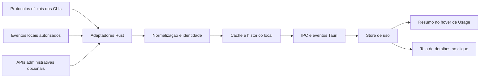

Atualização de implementação em 16/09/2026: Cursor passou a coletar tokens locais por hook opcional; Grok passou a consultar plano e períodos pelo ACP com autenticação pessoal. Franquia pessoal Cursor e consumo incluído Grok continuam indisponíveis nos contratos validados. Estado atual: [Uso dos agentes](agent-usage.md).

# Estudo: painel de uso dos agentes

Data: 2026-09-16.
Status: estudo aprovado, com a primeira implementação local concluída. Escopo entregue e validação em [Uso dos agentes](agent-usage.md). As seções abaixo preservam o estudo e incluem propostas para etapas posteriores.
Escopo inicial: Codex CLI, Claude Code, Cursor CLI e Grok Build.

## Recomendação

Adicionar **Usage** imediatamente acima de **Settings**, no rodapé da sidebar. Passar o mouse mostra um resumo flutuante, item por item por agente; clicar abre uma tela ampla com os detalhes. Esta direção incorpora a preferência do usuário em 2026-09-16 e substitui a proposta inicial de aba no workbench direito.

Começar com Codex e Claude Code, condicionando as métricas à versão e à capacidade comprovada de cada integração. Cursor e Grok aparecem na mesma estrutura, com integração parcial quando necessário. Traduzir os rótulos para **Uso** e **Configurações** em PT-BR conforme o idioma do app.

A principal decisão de produto é separar três perguntas:

| Pergunta | Informação | Escopo |
|---|---|---|
| Quanto ainda posso usar? | Cota consumida, saldo disponível e próxima renovação | Conta e janela do provedor |
| Onde estou consumindo? | Tokens, sessões e atividade observada | Sessão, projeto ou máquina, conforme a fonte |
| Quanto estou pagando? | Cobrança informada ou estimativa identificada | Conta de cobrança e período |

Esses valores não são intercambiáveis. Três sessões abertas com a mesma conta podem compartilhar uma única cota. Uma porcentagem da assinatura não permite calcular tokens restantes nem converter consumo em dólares.

Premissa para a primeira entrega: uso individual das contas que o desenvolvedor já utiliza nos CLIs. Integrações administrativas de organizações entram depois. Essa é uma proposta de escopo, não uma constatação sobre os planos contratados pelo usuário.

## Base existente no Metacodex

Inspeção do checkout em 2026-09-16, incluindo o estado local dos arquivos:

| Peça | O que já existe | Aplicação no painel |
|---|---|---|
| `src/features/terminal/cli-registry.ts` | Identificadores `codex-cli`, `claude-code`, `cursor-cli` e `grok` | Associar ferramenta a adaptadores, sem confundir instalação com autenticação |
| `src/features/terminal/sessionController.ts` | Ciclo de vida de PTYs, projeto, diretório e ambiente por lançamento | Vincular a observação à sessão e configurar integração local quando habilitada |
| `src/components/tabs/types.ts` | `CliTabT.cliId` e `providerSessionId` opcional | Relacionar aba, PTY e sessão do provedor |
| `src/features/resume/useSessionCapture.ts` | Captura de ID por texto do terminal | Evidência auxiliar; a captura atual é heurística |
| `src/features/terminal/tabMetadata.store.ts` | PID, diretório, branch e portas | Contexto local da sessão, sem métricas de faturamento |
| `src/components/v3-shell/RepoRow.tsx` | Indicador de atividade por sessão | Acesso contextual ao detalhe de uso |
| `src/components/v3-shell/AgentSidebar.tsx` | Settings no rodapé fixo, separado da lista rolável de projetos | Adicionar Usage na linha imediatamente acima |
| `src/components/settings/SettingsDialog.tsx` e `src/app/AppShell.tsx` | Tela ampla de configurações sobre o workspace | Referência de apresentação e montagem para a tela de detalhes de uso |
| `src-tauri/src/config_paths.rs` | Persistência JSON atômica | Cache de métricas e configurações sem segredos |

Não foi encontrada uma implementação de coleta de cotas, tokens ou custos nas áreas de terminal, resume, comandos Rust e IPC examinadas. A feature precisa de uma camada de integração nova, mas pode reutilizar o shell e a identidade das sessões.

O indicador `working` é uma heurística de atividade. Tempo aberto, tempo de processo e volume de texto no terminal não comprovam consumo de modelo. Não usar esses sinais para estimar tokens ou dinheiro.

## Viabilidade por provedor

Os contratos de Claude, Cursor e xAI e suas fontes estão detalhados no [levantamento de provedores](research-agent-usage-providers.md). A classificação abaixo é uma avaliação de engenharia baseada nessas evidências, não uma integração já testada em contas reais.

| Provedor | Cota e renovação da conta | Tokens e custo | Viabilidade inicial |
|---|---|---|---|
| Codex | Protocolo oficial do CLI; janelas e campos opcionais | Atividade da conta e contratos de sessão; estimativas quando disponíveis | Alta para conta/limites; validar atribuição às sessões |
| Claude Code | Statusline oficial em versões compatíveis e planos contemplados | Custo estimado; OTel para métricas acumuladas | Alta para cotas; requer integração local habilitada |
| Cursor | `/usage` e dashboard; exportação estruturada individual não confirmada | Tokens anunciados em hooks/stream-json; API administrativa para organizações elegíveis | Parcial; contrato local precisa de uma prova de integração |
| Grok Build | `/usage` conforme autenticação; JSON de cotas não confirmado | Indicador local de custo; Management API xAI é uma integração separada | Parcial no CLI; caminho documentado para API xAI |

Fontes da matriz: [Codex App Server](https://developers.openai.com/codex/app-server/), [Claude statusline](https://code.claude.com/docs/en/statusline), [Cursor CLI changelog](https://cursor.com/docs/cli/changelog), [Cursor APIs](https://cursor.com/docs/api), [Grok comandos](https://docs.x.ai/build/modes-and-commands), [xAI Management API](https://docs.x.ai/developers/management-api-guide).

### Codex

Há um caminho oficial pelo App Server do próprio CLI: `account/read`, `account/rateLimits/read`, `account/usage/read` e notificações de uso. O método de limites fornece janelas e porcentagens; o de atividade pode fornecer agregados diários. A disponibilidade depende da autenticação e dos campos retornados. A documentação distingue essa superfície da API de inferência. [App Server](https://developers.openai.com/codex/app-server/).

Verificação local adicional: `codex-cli 0.153.2`. Foram gerados os tipos com `codex app-server generate-ts` em um diretório temporário, sem consulta autenticada, leitura de conversas ou inferência. O schema local confirmou:

- `GetAccountRateLimitsResponse`: `rateLimitsByLimitId`, fallback `rateLimits` e `accountId` opcional.
- `RateLimitWindow`: `usedPercent`, `windowDurationMins` e `resetsAt`.
- `GetAccountTokenUsageResponse`: resumo e buckets diários opcionais.
- `GetAccountTokenUsageParams`: `threadId` opcional.
- `ThreadUsage`: créditos estimados e USD estimado, quando disponíveis, com valores em micros.
- `ThreadTokenUsageUpdatedNotification`: identidade da thread e do turno com contadores de tokens.

Proposta: um adaptador Rust que utilize o executável instalado e seu protocolo, com chamadas de leitura permitidas explicitamente. Detectar versão e capacidades. Reutilizar o contexto de autenticação do CLI escolhido; não copiar tokens para o frontend. O primeiro protótipo precisa validar a convivência desse cliente com os CLIs já abertos.

Não presumir que um App Server auxiliar receberá eventos de todas as sessões PTY independentes. Para atribuição por sessão, exigir ID verificado e testar a consulta correspondente; manter a visão de conta funcionando quando a atribuição não estiver disponível. `threadUsage` permanece uma estimativa mesmo quando retornado pelo fornecedor.

O contrato permite múltiplos limites. Não fixar os títulos em cinco horas e semana: usar a duração e a identificação recebidas. Campos ausentes significam indisponibilidade. A versão instalada confirma o contrato local, mas não prova que uma conta específica tenha acesso aos resultados.

OpenAI API é uma integração distinta: Usage/Costs e credenciais administrativas podem atender o consumo da organização. Esse total não representa a assinatura do ChatGPT. [Usage API](https://platform.openai.com/docs/api-reference/usage), [Admin API keys](https://platform.openai.com/docs/api-reference/admin-api-keys), [separação de cobrança](https://help.openai.com/en/articles/9039756).

### Claude Code

O primeiro adaptador deve usar o JSON oficial da statusline. A documentação exige versão 2.1.251 ou posterior para `rate_limits`; cotas de cinco horas e sete dias são condicionais e aparecem após atividade. O custo indicado é estimado. Contexto e uso acumulado exigem tratamentos diferentes. [Statusline](https://code.claude.com/docs/en/statusline), [custos](https://code.claude.com/docs/en/costs).

Proposta: habilitação por lançamento com `--settings`, preservando configurações globais e compondo com uma statusline existente quando isso for seguro e testado. A flag é oficial; o wrapper que encaminha o JSON ao Metacodex é trabalho novo. Políticas gerenciadas continuam tendo precedência. [CLI reference](https://code.claude.com/docs/en/cli-reference), [precedência](https://code.claude.com/docs/en/settings#settings-precedence).

Para histórico de tokens, considerar o canal oficial OpenTelemetry em uma etapa posterior. Ele requer configuração própria e preservação de exporters existentes. Uma releitura local da statusline não renova o dado do provedor. [Monitoramento](https://code.claude.com/docs/en/monitoring-usage).

### Cursor

Há evidência oficial de tokens por turno e IDs de sessão em hooks, além de `/usage` para consultar o plano. A referência detalhada dos payloads ainda diverge do changelog. Portanto, validar o hook e sua versão antes de anunciar métricas locais completas. `stream-json` em execução headless não deve substituir a TUI existente apenas para medir consumo. [Changelog](https://cursor.com/docs/cli/changelog), [output format](https://cursor.com/docs/cli/reference/output-format), [hooks](https://cursor.com/docs/hooks).

Na conta individual, manter o acesso à consulta oficial enquanto não houver uma exportação estruturada validada. Para organizações, Admin API oferece gasto e eventos, mas a elegibilidade tem divergência entre páginas; planejar com a restrição Enterprise da visão geral e confirmar acesso na conexão. Dados de eventos têm consolidação horária. [APIs](https://cursor.com/docs/api), [Admin API](https://cursor.com/docs/account/teams/admin-api).

### Grok Build e xAI

O CLI oficial possui `/usage` e statusline, mas não foi confirmado um schema público de cotas/reset da assinatura. O custo visual é associado ao processo, o que exige cuidado ao retomar sessões; o modo script também tem ressalva de suporte no Windows. Entregar estado parcial até validar um payload estruturado. [Comandos](https://docs.x.ai/build/modes-and-commands), [statusline](https://docs.x.ai/build/features/status-line).

A API xAI permite histórico, saldo e limites com management key própria. Esse conector mede a conta/team da API. O campo de inferência `cost_in_usd_ticks` tem semântica de cobrança por requisição, mas sua existência na API não comprova exposição pelo CLI. [Management API](https://docs.x.ai/developers/management-api-guide), [billing](https://docs.x.ai/developers/rest-api-reference/management/billing), [cost tracking](https://docs.x.ai/developers/cost-tracking).

Outros agentes podem entrar depois como novos adaptadores com capacidades explícitas. O cadastro no launcher sozinho não garante integração de consumo.

## Proposta de interface

### Entrada na sidebar

Rodapé fixo com duas linhas empilhadas: **Usage** e **Settings**. A lista de projetos continua rolando acima delas. O item Usage usa ícone de consumo e o mesmo padrão de tipografia, altura e foco de Settings. Um indicador discreto pode sinalizar limite próximo, sem inventar uma porcentagem geral entre agentes.

O acesso é global e funciona mesmo sem projeto aberto. A command palette oferece **Uso dos agentes**, inclusive quando a sidebar estiver recolhida. Preservar o indicador atual de atividade das sessões.

### Hover: resumo por agente

O resumo é um popover não modal, ancorado ao item Usage. Ele não escurece o workspace nem captura o foco do terminal. Abrir após aproximadamente 250 ms evita disparos ao atravessar a sidebar. Como o botão fica na parte inferior esquerda, preferir abertura à direita com alinhamento inferior e correção automática de posição, sempre com margem de 8 px do viewport.

Uma seção compacta por agente conectado, em ordem estável:

| Conteúdo de cada item | Apresentação |
|---|---|
| Identificação | Ícone, nome do agente e conta quando necessária para distinguir perfis |
| Uso | Barra e texto explícito, por exemplo, percentual consumido na janela identificada |
| Renovação | Tempo até renovar e horário exato acessível |
| Janela adicional | Segunda barra somente quando o fornecedor informar outra cota relevante |
| Disponibilidade | Estado parcial, aguardando dados ou última observação desatualizada |

Codex, Claude, Cursor e Grok ocupam itens próprios. Dados indisponíveis aparecem como **Sem dados de cota**, nunca como 0%. Não preencher agentes desconectados com valores demonstrativos. Contas distintas do mesmo agente têm identificação separada; abas da mesma conta compartilham o mesmo resumo de cota.

No rodapé do popover, **Ver detalhes** abre a tela completa. O clique no próprio item Usage faz o mesmo. Clicar em um agente dentro do resumo pode abrir os detalhes já filtrados para aquele agente.

O popover permanece aberto enquanto o ponteiro estiver no botão ou no conteúdo, permitindo cruzar o espaço entre eles e clicar. Fechar ao sair de ambos com pequeno atraso, ao pressionar Escape ou ao abrir os detalhes. Limitar altura e permitir rolagem se houver muitas contas. Animação apenas de opacidade, seguindo a regra do projeto.

O resumo também pode aparecer ao focar Usage pelo teclado. Enter ou Espaço abre diretamente os detalhes, sem depender do hover. Em toque, o clique abre diretamente a tela completa. Ao abrir um diálogo como Settings, fechar o resumo.

### Clique: tela ampla de detalhes

Proposta de implementação: uma tela em diálogo amplo, no mesmo padrão de Settings, com espaço para gráficos e tabelas. Montar a partir de AppShell e manter os terminais vivos por baixo. Fechar retorna ao contexto anterior. Esse formato atende à tela dedicada solicitada sem ocupar a coluna estreita do workbench.

Conteúdo:

1. **Visão geral**: contas conectadas, limites por janela, renovação e atualização.
2. **Detalhes por agente**: plano quando conhecido, capacidades, origem dos dados, custos disponíveis e acesso ao painel oficial.
3. **Histórico**: evolução no período, com distinção entre cota da conta e atividade coletada localmente.
4. **Sessões e projetos**: ferramenta, modelo, tokens e custo somente quando houver atribuição comprovada. Filtros de período e projeto não alteram artificialmente a cota global.

Ao clicar em Usage, abrir a visão geral. Ao clicar em uma linha de agente no resumo, abrir seu detalhe. A tela recebe foco, permite navegação por teclado e fechamento por Escape; ao fechar, devolver foco ao acionador disponível. Em janela pequena, ajustar o layout e a rolagem à área visível.

Resumo e tela completa usam o mesmo snapshot de dados. O hover mostra o cache imediatamente e pode solicitar atualização em segundo plano, respeitando a política do adaptador. Abrir e fechar o resumo repetidamente não dispara uma consulta nova a cada movimento.

O detalhe deve mostrar a origem e a abrangência de cada número: **Conta inteira**, **Sessão no Metacodex**, **API da organização**, **Estimativa** ou **Cobrança informada**. Esses rótulos resolvem diferenças reais entre os provedores.

Estados necessários: CLI não encontrado, integração desativada, autenticação necessária, aguardando primeira atividade, atualizado, desatualizado, acesso administrativo necessário, recurso não suportado e erro temporário.

Uma sessão iniciada não comprova autenticação. O texto **Conectado** só aparece quando a integração consegue validar o vínculo necessário. Sem confirmação de conta, mostrar perfil local ou conta não identificada; não juntar perfis distintos por nome do provedor.

Alertas opcionais de cota em 80%, 95% e esgotamento, com deduplicação por conta, limite e janela. Renovação gera uma nova janela. Um campo desconhecido nunca aciona alerta de cota zero. O horário deve incluir data quando necessário e respeitar o fuso do usuário.

## Arquitetura proposta



Os adaptadores pertencem ao Rust. React recebe dados normalizados e estados de carregamento. A coleta não depende de o componente visual estar montado e não passa pelo fluxo de bytes do xterm.

Estrutura sugerida:

```text
src-tauri/src/usage/
  mod.rs
  types.rs
  manager.rs
  store.rs
  providers/
    codex.rs
    claude.rs
    cursor.rs
    xai.rs
src-tauri/src/commands/usage.rs
src/features/usage/
  usage.types.ts
  usage.service.ts
  usage.store.ts
  usage.ui.store.ts
  usage.selectors.ts
src/components/usage/
  UsageSidebarItem.tsx
  UsageHoverCard.tsx
  UsageDialog.tsx
  UsageOverview.tsx
  UsageAccounts.tsx
  UsageSessions.tsx
```

Comandos propostos: `usage_list_connections`, `usage_get_snapshot`, `usage_refresh` e comandos específicos de habilitação/desabilitação. Evento agregado `usage://updated`. Registrar os nomes em `lib.rs`, `ipc.ts`, `events.rs` e `events.ts`, seguindo o contrato do repositório, e atualizar a cobertura em `src/test/ipcParity.test.ts`. Aplicar permissões correspondentes quando necessárias.

Alterações de integração: rodapé de `AgentSidebar.tsx`, montagem de `UsageDialog` em `AppShell.tsx`, app commands, command palette e traduções `en`/`pt-BR`. `usage.ui.store.ts` guarda abertura e seleção da tela; `usage.store.ts` guarda os dados. O hover tem estado transitório próprio. Essa proposta dispensa acrescentar Usage às superfícies de `sidePanel.store.ts` ou ao menu `+` do workbench.

Usar tokens e componentes existentes. Para o resumo interativo, criar um componente de hover apropriado com posicionamento e passagem segura do ponteiro; `@floating-ui/react` já consta nas dependências. O Tooltip atual é destinado a dicas simples e não deve receber botões interativos. A tela ampla pode seguir o Dialog Radix já utilizado por Settings. Preservar PTYs e documentos montados ao abrir e fechar a tela.

Esse desenho acrescenta observabilidade ao workspace atual. Não exige um novo executor de agentes, chat próprio ou retorno da antiga Agent View.

## Modelo de dados

Separar entidades, porque um CLI pode usar vários modelos e provedores:

| Entidade | Identidade e campos principais |
|---|---|
| `UsageConnection` | `connectionId`, `toolId`, provedor de cobrança, conta/perfil, modo de autenticação e capacidades |
| `QuotaSnapshot` | Conta, `limitId`, janela, percentual usado, instante de renovação, observação e origem |
| `SessionUsage` | Conexão, ID do provedor, PTY, aba, projeto, modelo e contadores |
| `MoneyMetric` | Valor decimal ou micros serializados com segurança, moeda, período e natureza do valor |
| `MetricProvenance` | Fonte, versão do adaptador, abrangência, horário observado e disponibilidade |

Proposta de classificação monetária: `billed`, `provider_estimate` e `local_estimate`. Cotação convertida para reais é uma apresentação separada e precisa registrar a taxa e a data. No MVP, preservar a moeda original.

Cada capacidade é independente: `quota`, `reset_time`, `account_history`, `session_tokens`, `session_cost`, `organization_spend`. Conexão bem-sucedida não torna todas as métricas disponíveis.

Regras de contabilização:

- Agrupar cota por identidade comprovada de conta/produto/limite, sem multiplicar pelo número de abas.
- Guardar `providerSessionId`, `ptySessionId` e `tabId` separadamente. Retomar uma sessão não cria consumo novo.
- Deduplicar eventos por identificador estável do fornecedor; em contadores cumulativos, atualizar o snapshot e calcular deltas por série e época, sem somar o acumulado a cada atualização.
- Tratar reset de contador, retomada, subagentes, fork, eventos fora de ordem e compactação explicitamente.
- Não somar atividade local ao agregado remoto da mesma conta. As coberturas podem se sobrepor.
- Não distribuir o gasto da conta pelos projetos usando proporção de tempo ou diferença de porcentagem.
- Preservar a semântica do fornecedor para cache e reasoning, inclusive quando forem subconjuntos de outros contadores.
- Manter total financeiro desconhecido se faltarem tarifas, modelo, consumo de ferramentas ou dados de cobrança.
- Para múltiplas abas com o mesmo diretório, o diretório sozinho não identifica a sessão. Sem vínculo inequívoco, deixar sem atribuição.
- Exibir o instante real da observação. Reler um cache não torna o dado recente.

## Coleta e persistência

Proposta inicial de atualização: consulta ao abrir o painel; leitura de limites Codex a cada 1-5 minutos enquanto necessária; eventos locais Claude assim que chegarem. Para Cursor Admin, respeitar a consolidação horária e a recomendação documentada de não consultar eventos mais de uma vez por hora. Cada adaptador terá sua própria política. Aplicar apenas uma consulta em andamento por conexão, timeout e backoff, respeitando `Retry-After`. O intervalo sugerido para Codex é uma escolha do produto a validar, não uma garantia do fornecedor.

Suspender polling desnecessário quando o aplicativo estiver inativo. Após retorno do sono, atualizar sob demanda. Não iniciar chamadas de modelo para atualizar indicadores. Em falha de rede, conservar o último valor com a indicação de desatualização.

Cache inicial em `~/.metacodex/state/usage/`, respeitando `METACODEX_HOME`, com JSON atômico, `schemaVersion`, checkpoint por fonte e agregados diários. Retenção sugerida: 90 dias de métricas. Não persistir prompts, respostas, saídas de ferramentas nem payloads brutos que possam conter esses dados.

O modelo atual de autorização de arquivos deve ser preservado: pastas de outros CLIs não são raízes de projetos. Se um adaptador futuro precisar ler arquivos externos, usar uma concessão dedicada, limitada à fonte aprovada; não ampliar as raízes gerais nem reutilizar concessões de clone para outra finalidade. Integrações que entregam eventos diretamente ao Metacodex reduzem essa necessidade.

Segredos administrativos, quando usados, ficam no armazenamento seguro do sistema operacional. Cache e frontend recebem apenas referências e metadados. Isso exige uma abstração nova no produto e validação em macOS e Windows; não está implementado hoje.

## Entregas e critérios de decisão

| Etapa | Entrega | Critério para avançar |
|---|---|---|
| 1. Prova de integração | Codex conta/limites; Claude statusline; payloads anonimizados | Confirmar dados em versões suportadas, identidade e atualização sem interferir nos CLIs |
| 2. MVP | Usage acima de Settings, resumo no hover, tela ampla no clique, cotas e renovação | Duas contas/provedores observáveis; mesmas métricas nas duas superfícies; várias abas não duplicam cota; desconhecido não aparece como zero |
| 3. Sessões e histórico | Atribuição exata, tokens, estimativas rotuladas e filtros | Resume, eventos repetidos e subagentes não produzem dupla contagem |
| 4. Provedores adicionais | Cursor e xAI conforme APIs e permissões disponíveis | Fonte documentada, custo operacional aceitável e cobertura explícita |
| 5. Organizações | APIs administrativas e relatórios de gasto | Identidade, escopo, paginação, moeda e período de faturamento conciliados |

Estimativa relativa: interface e cache têm complexidade moderada; atribuição confiável de sessões e compatibilidade entre versões são a parte mais difícil. A primeira etapa deve dimensionar o restante antes de fixar prazo.

Validação necessária na implementação: testes de normalização e deduplicação, fixtures por versão, conta trocada durante a sessão, ausência de campos, 401/403/429, operação offline, retomada e renovação. Verificar as duas superfícies em PT-BR e inglês, light/dark e ambos os sistemas operacionais suportados. Cobrir passagem do ponteiro entre botão e resumo, Escape, clique abrindo somente a tela completa, navegação por teclado, foco restaurado, janela pequena, sidebar recolhida, muitas contas e ausência de consultas duplicadas. Executar os checks do projeto para o código que vier a ser alterado.

## Limites deste estudo

Pesquisa em documentação oficial, inspeção do checkout e geração local de schemas do Codex. Não houve teste autenticado contra contas de cobrança, mudança nas configurações dos CLIs nem implementação do painel. O schema local demonstra formato suportado pelo binário; a presença e atualização dos valores ainda precisam de validação prática.

Os arquivos de produto já tinham mudanças locais antes deste estudo. Este trabalho acrescenta apenas documentação. Datas, disponibilidade por plano e contratos devem ser revalidados na prova de integração.
